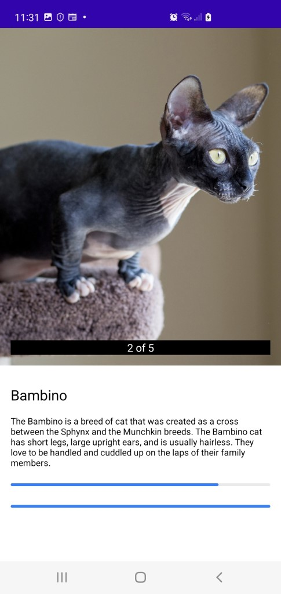

## *Lyst Cat* - Introduction

Simple app to display a **Lyst** of Cats using https://thecatapi.com/

## Running and Building

This app was built with Android Studio Bumblebee 2021.1.1

To run, just hit the run button

## Composables vs XML

*Because I don't know whether you use composables or xml views, I have built the Main view using compose and the cat detail page using xml. I wouldn't normally do this - it is just for demonstration because I didn't know what you prefer at Lyst.*

## Overview

It is basically made up of two activities (Main and Detail). The *Main* activity hosts 3 main composable screens and the *Detail* screen hosts one fragment

The first activity hosts the main section which contains three sections as follow:

1. **Home (Composable)** => Displays all breeds of cats

2. **Search (Composable)** => Allows user to search cats

3. **MyCat (Composable)** => Empty

The second activity is driven by a navigation graph with just one fragment in it:

1. **Cat Detail (Fragment)** => After a cat has been clicked on, shows the details of the cat (name, description etc)

## Because time was limited for me on this demo, please note ##

* There is not much in the way of error checking
* DTO objects in data (Breed.kt) should really be mapped to domain objects - because I'm out of time, I just use them in the domain layer
* Strings are hardcoded
* Comments are lacking
* Views are very basic and would need improving upon
* I didn't take much care in styling / colouring etc
* Loads more could be added / improved upon
* Add Composable Previews
* The list goes on and on......

## Testing

To test individual use cases, you would add something along the lines of:

* Create a fake repository of type CatRepository
* In the test case, along with the FakeRepository, also instantiate the test case class to be tested.
* We can then test our use case against our fake repo and and make assertions as required

## Other libraries used

* Retrofit
* Glide

## Screenshots

